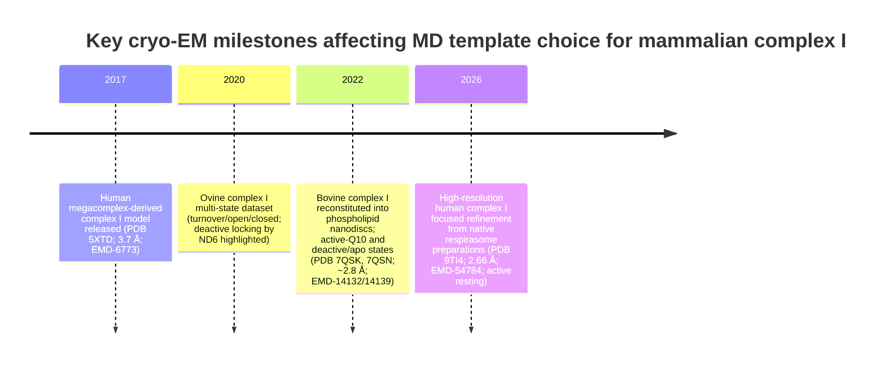

# MD-ready atomic models of human mitochondrial complex I for MT‑ND6 and LHON interpretation

## Executive summary

The best currently available **human** atomic model of mitochondrial complex I suitable as an all‑atom MD starting point (with strong MT‑ND6 coverage) is **PDB 9TI4 (EMD‑54784; 2.66 Å)**, derived from a high‑resolution structure of native human respirasome preparations and refined as a focused complex I map. citeturn17view0turn34view1turn45view2 It is explicitly assigned to an **active resting** state, contains clear densities for **FMN, NADPH, and Fe–S clusters**, and includes a small but useful set of modelled phospholipids (including cardiolipins), while showing **no definitively modelled ligand in the Q channel** (only broken/ambiguous density). citeturn34view1

Only one widely used earlier **peer‑reviewed human** full complex I model is available at substantially lower resolution, **PDB 5XTD (EMD‑6773; 3.70 Å)**, derived from the human respiratory megacomplex study (I\₂III\₂IV\₂). citeturn42view0turn43view0turn45view3 It remains valuable as a historical reference and alternative human template, but it is less reliable for side‑chain‑level interpretation and typically requires more rebuilding/modelling.

Because **Q‑site occupancy and membrane context** are central to mechanistic interpretation (including ND6‑proximal conformational effects), the highest‑value *non‑human* surrogates for simulations are the **bovine phospholipid‑nanodisc** structures from **PDB 7QSK (EMD‑14132; “Active‑Q10”; 2.84 Å)** and **PDB 7QSN (EMD‑14139; “Deactive‑apo”; 2.81 Å)**, whose primary paper explicitly targets ubiquinone‑10 binding and state‑dependent conformational changes. citeturn42view1turn42view2turn41search8turn45view0turn45view1 These surrogates are exceptionally informative for placing Q10 and comparing active vs deactive conformations, but they have **substantially more unmodelled residues** than 9TI4 and require heavier preprocessing for full‑complex MD. citeturn45view0turn45view1

**Recommended single template for full‑complex all‑atom MD (human MT‑ND6/LHON focus):** **PDB 9TI4**. It offers the best combination (human sequence, high resolution, state annotation, and completeness). To study Q‑site occupancy realistically, transfer/optimise a Q10 pose using the bovine nanodisc “Active‑Q10” structures as a structural guide (e.g., 7QSK), then equilibrate carefully in an IMM‑like bilayer. citeturn34view1turn41search8turn42view1

## What makes an “MD‑suitable” complex I atomic model

MD readiness is not just global map resolution; it is a practical intersection of:

**Atomic interpretability**
- Sub‑3 Å (or near) resolution in the region you care about (here, the membrane arm around ND6 and the E‑channel/Q‑site vicinity), plus clearly assigned conformational/state context (active/resting/deactive/inhibited). citeturn34view1turn42view2

**Sequence fidelity for MT‑ND6/LHON**
- ND6 present as a continuous chain of expected length, with interpretable side chains in the helix/loop containing disease‑relevant positions; and (for non‑human surrogates) a tractable mapping via sequence alignment. citeturn9view2turn44view0turn44view1turn44view2

**Biochemical context relevant to simulations**
- Sample conditions that minimise artefacts: lipid nanodiscs often better preserve membrane‑embedded conformations and substrate binding than detergent micelles; conversely, some human high‑resolution structures still come from detergent‑solubilised material. citeturn41search8turn33view0turn34view1

**Completeness and repair burden**
- Low “deposited vs modelled residue” gaps reduce the amount of modelling you must do before MD (loops, termini, and supernumerary subunit segments). The bovine nanodisc datasets are information‑rich but have large unmodelled fractions, whereas the best human structure is comparatively complete. citeturn45view2turn45view0turn45view1turn45view3

## Shortlist table of high‑value templates

Data repositories referenced below: entity["organization","RCSB Protein Data Bank","pdb archive portal"] (PDB IDs) and entity["organization","Electron Microscopy Data Bank","emdb archive"] (EMD IDs). citeturn17view0turn42view0turn42view1turn42view2

| Rank-use | Model (PDB / EMDB) | Organism | Global resolution and local notes | Sample/prep context (respirasome/isolated; detergent/nanodisc) | Functional state assignment | MT‑ND6 / ND6 completeness (chain length; LHON-site coverage implications) | Cofactors / ligands explicitly supported | Lipids / detergents in model | Practical MD caveats (missing residues burden; notable density issues) |
|---|---|---|---|---|---|---|---|---|---|
| Best human starting template | 9TI4 / EMD‑54784. citeturn17view0turn45view2 | Human | 2.66 Å; reported “consistent local resolution” for focused CI map. citeturn34view1turn17view0 | Native human respirasome purification (HEK293); membranes solubilised in LMNG; local refinement yields CI map/model. citeturn33view0turn34view1 | Active resting state (explicitly concluded). citeturn34view1 | ND6 listed as 173‑residue chain (expected to cover internal LHON‑relevant positions; confirm residue numbering during setup). citeturn9view2 | FMN, NADPH, and Fe–S clusters visible/modelled; no NADH; Q channel lacks a defined bound ligand (broken/ambiguous density). citeturn34view1 | 14 phospholipids modelled (6 cardiolipin + 8 PE‑type lipids) mainly at CI–CIII interface. citeturn34view1 | Very small residue gap (8244 modelled vs 8261 deposited). citeturn45view2 Q‑site ligand uncertainty is the main limitation for Q‑chemistry simulations. citeturn34view1 |
| Human backup / legacy reference | 5XTD / EMD‑6773. citeturn42view0 | Human | 3.70 Å (local variation not summarised on the entry page; expect weaker side‑chain confidence in parts of the membrane arm). citeturn42view0 | Derived from the human respiratory megacomplex study (I\₂III\₂IV\₂); complex I deposited as a 45‑subunit assembly. citeturn43view0turn42view0 | State not explicitly labelled on the entry page; treat as a structural/resting conformation unless you independently classify by known markers. citeturn42view0turn43view0 | ND6 listed as 174‑residue chain (broad LHON coverage by length; residue‑level interpretation limited by 3.7 Å resolution). citeturn44view0turn42view0 | “Subset of associated cofactors” noted in the megacomplex paper abstract; use ligand list from the PDB file during preparation to confirm FMN/Fe–S/other nonpolymers. citeturn43view0 | Lipid/detergent details not enumerated in the RCSB summary excerpt; treat as detergent‑solubilised cryo‑EM era template requiring membrane rebuilding. citeturn42view0turn43view0 | Moderate residue gap (8191 modelled vs 8236 deposited). citeturn45view3 Useful for cross‑checking human subunit placements but not ideal alone for side‑chain‑level ND6/LHON hypotheses. citeturn42view0 |
| Best Q10 placement reference (non‑human) | 7QSK / EMD‑14132. citeturn42view1turn41search12 | Bovine (cattle) | 2.84 Å. citeturn42view1 (Paper reports multiple states, global resolutions up to ~2.3 Å across the dataset.) citeturn41search8 | Mammalian complex I reconstituted into phospholipid nanodiscs with exogenous Q10. citeturn41search8 | Active state with ubiquinone‑10 bound (entry title/state). citeturn42view1turn41search12 | ND6 present as 175‑residue chain; use alignment to map human MT‑ND6 positions for LHON interpretation. citeturn44view1 | Q10 bound (key feature); other redox cofactors expected for intact CI but confirm via ligand list when building MD system. citeturn41search8turn42view1 | Nanodisc provides native‑like bilayer context; still embed into a larger IMM‑like membrane for production MD. citeturn41search8 | Large unmodelled fraction (8291 modelled vs 9212 deposited) implies substantial loop/terminus rebuilding if you need a fully complete all‑atom complex. citeturn45view0 |
| Best deactive‑state reference for ND6 gating (non‑human) | 7QSN / EMD‑14139. citeturn42view2 | Bovine (cattle) | 2.81 Å. citeturn42view2 | Same nanodisc dataset as above (state comparisons designed into the study). citeturn41search8 | Deactive‑apo (entry title/state). citeturn42view2 | ND6 present as 175‑residue chain; alignment needed for human LHON mapping. citeturn44view2 | Apo Q‑site condition is useful for comparing how Q‑site/ND6 region shifts between active and deactive states (interpretation requires careful state definition). citeturn41search8turn42view2 | Nanodisc (native‑like membrane context). citeturn41search8 | Even larger unmodelled fraction (8201 modelled vs 9212 deposited). citeturn45view1 |

## Key model notes for MT‑ND6–focused simulations

### PDB 9TI4 (human; recommended base protein template)
This model comes from a focused refinement of complex I derived from native human respirasome preparations, solubilised using LMNG, and refined to 2.66 Å with reported consistent local resolution. citeturn33view0turn34view1turn17view0 The authors explicitly classify the conformation as an **active resting state** and report clear densities for **FMN, NADPH, and Fe–S clusters**, but not NADH. citeturn34view1 For Q‑site studies, an important limitation is that the ubiquinone channel does **not** contain a single confidently modelled ligand; instead, it shows broken/ambiguous densities reminiscent of other active/closed structures lacking defined bound ligand. citeturn34view1

For MT‑ND6, the entry lists ND6 as a **173‑residue** membrane subunit, consistent with near‑full coverage; hence most clinically relevant internal positions should lie within the modelled chain (verify residue numbering directly in your coordinate processing pipeline to avoid off‑by‑one issues). citeturn9view2

A practical advantage for full‑complex MD is completeness: the RCSB entry reports **8244 modelled residues vs 8261 deposited** (small gap), reducing the amount of rebuilding required before simulation. citeturn45view2 The model also includes a modest but useful lipid set (cardiolipins plus PE‑type lipids), mainly at the CI–CIII interface, which can help anchor/validate your membrane embedding strategy even if you later replace lipids with a more realistic IMM mixture. citeturn34view1

### PDB 5XTD (human; secondary/legacy template)
This earlier human complex I cryo‑EM model (3.70 Å) originated from the human respiratory megacomplex (I\₂III\₂IV\₂) structural study and provides an alternative full‑complex reference. citeturn42view0turn43view0 ND6 is present as a **174‑residue** chain. citeturn44view0

For MT‑ND6/LHON interpretation, the key caution is resolution: at ~3.7 Å, **side‑chain assignments and helix register in some membrane‑arm areas can be uncertain**, especially in regions of poorer local density, and may require restraint‑guided refinement or comparative modelling against newer high‑resolution structures. citeturn42view0turn34view1 The residue‑completeness gap (8191 modelled vs 8236 deposited) is moderate. citeturn45view3

### PDB 7QSK and 7QSN (bovine nanodisc surrogates; best Q‑site/state references)
The bovine nanodisc dataset was designed specifically to define **ubiquinone‑10 binding** and state‑dependent conformational transitions, using phospholipid nanodiscs to avoid detergent‑micelle artefacts. citeturn41search8 Within this set, 7QSK provides an **active‑state Q10‑bound** reference and 7QSN provides a **deactive‑apo** reference at comparable resolutions (~2.8 Å). citeturn42view1turn42view2

For MT‑ND6/LHON work, these bovine structures are exceptionally valuable as **structural guides** to: (i) place Q10 plausibly in the channel; and (ii) compare how the ND6‑adjacent region behaves across active vs deactive states. citeturn41search8turn42view1turn42view2 ND6 is present in both as a **175‑residue** chain, enabling straightforward human mapping by alignment (while recognising residue identity differences). citeturn44view1turn44view2

The major practical downside for “full‑complex, fully all‑atom” MD is the amount of rebuilding: both entries have large deposited‑vs‑modelled residue gaps (hundreds to ~1000 residues), implying many flexible segments were not built into coordinates at deposition. citeturn45view0turn45view1 If your simulation requires the intact peripheral supernumerary architecture, you will need an aggressive loop/terminus modelling strategy (see checklist below).

## Recommended single best starting template and trade-offs

### Recommended single template
**PDB 9TI4 (human; 2.66 Å; active resting)** is the best single starting point for **full‑complex all‑atom MD** aimed at MT‑ND6/LHON interpretation. citeturn17view0turn34view1turn45view2

**Why this is the best single choice**
- **Human sequence fidelity**: avoids uncertain cross‑species mapping at the outset (critical when interpreting LHON variants in a mitochondrial gene). citeturn17view0turn9view2  
- **High resolution with state annotation**: 2.66 Å focused CI map, explicitly classified as active resting, supporting better helix register and side‑chain placement around ND6 than older human models. citeturn34view1turn42view0  
- **Cofactor completeness**: clear densities for FMN, NADPH, and Fe–S clusters are reported, supporting realistic electrostatics and redox‑site modelling (even though redox/protonation states remain an assumption to be defined). citeturn34view1  
- **Repair burden is low**: only a small discrepancy between deposited and modelled residues. citeturn45view2  
- **Some lipid guidance**: includes cardiolipins and PE‑type lipids, useful anchors when building an IMM‑like environment. citeturn34view1  

### Key trade-offs you should plan around

**Human (9TI4/5XTD) vs bovine nanodisc (7QSK/7QSN)**
- Human models are best for **direct LHON interpretation**, but the newest human high‑resolution model lacks a confidently modelled Q‑site ligand. citeturn34view1turn17view0  
- Bovine nanodisc models offer the best **Q10‑bound geometry and membrane‑like context**, but require **cross‑species mapping** and extensive rebuilding of missing segments if you need a complete all‑atom complex. citeturn41search8turn45view0turn45view1  

**Respirasome-derived context vs isolated complex**
- 9TI4 originates from a respirasome purification and local refinement; lipids resolved at the CI interface may reflect supercomplex‑adjacent packing and may not fully represent “free CI” membrane contacts. citeturn33view0turn34view1  
- If you simulate isolated CI, you may need to consider whether removing CIII‑adjacent lipids leaves unrealistically exposed hydrophobic patches; conversely, retaining them may over‑stabilise one interface. citeturn34view1  

**Nanodisc vs detergent**
- Nanodiscs are explicitly motivated as more native‑like and less artefact‑prone for ligand/state questions in the 2022 dataset. citeturn41search8  
- Detergent‑derived models can still be excellent protein templates (as 9TI4 demonstrates), but lipid occupancy and membrane thinning/curvature constraints must be rebuilt during MD. citeturn33view0turn34view1  

**Uncertainty in protonation and redox states**
- All the listed coordinate models require you to choose: FMN redox/protonation, Fe–S reduction pattern, Q10 redox state (especially if inserted), and key titratable residues along the E‑channel/antiporter-like subunits. Even when Q10 is present, the 2026 human respirasome complex I discussion highlights that redox states may be ambiguous in related quinone-site modelling (and analogous cautions apply here). citeturn34view1turn34view2  

## MD preprocessing checklist for complex I templates

These steps are written to be template‑agnostic, but the **repair burden** differs strongly between 9TI4/5XTD and 7QSK/7QSN. citeturn45view2turn45view0turn45view1turn45view3

### Coordinate and model integrity
- Choose the correct biological assembly and chain set (complex I is a hetero “45‑mer” with 44 unique protein chains in these entries). citeturn17view0turn45view0turn45view1  
- Audit completeness using *modelled vs deposited residue counts* and explicit missing segments; decide whether missing peripheral segments matter for your hypothesis (ND6‑adjacent membrane arm questions often tolerate missing distal peripheral loops, but not missing transmembrane helices). citeturn45view2turn45view0turn45view1turn45view3  
- Resolve non‑standard residues/PTMs cautiously; high‑resolution structures may include PTMs that your force field does not natively describe. citeturn34view2  

### Protonation, redox, and ligands
- Define pH/ionic conditions, then assign protonation states (His/Asp/Glu/Lys, plus titratable residues in proton pathways).  
- Decide redox states for **FMN and Fe–S clusters** and (if present/added) **Q10**; document assumptions explicitly for reproducibility. citeturn34view1turn41search8  
- If using 9TI4 and you need Q10 occupancy, consider positioning Q10 using the bovine “Active‑Q10” nanodisc geometry as a structural guide, then relax with restrained equilibration. citeturn34view1turn42view1turn41search8  

### Membrane embedding and lipid composition
- Rebuild an IMM‑like bilayer (cardiolipin‑enriched; PE/PC mix), using any resolved cardiolipins as “anchor hints” but not as a full lipid inventory. citeturn34view1turn41search8  
- Ensure correct orientation (matrix vs IMS side) and avoid bilayer overlaps with detergent/lipid placeholders retained from the PDB. citeturn33view0turn41search8  

### Force-field and parameterisation
- Use a consistent MD force field for proteins and lipids (e.g., CHARMM36-family or Amber lipid/protein combinations), and source/validate parameters for FMN, NAD(P)H, Q10, and Fe–S clusters (often requiring specialised parameter sets or bonded models). citeturn34view1turn41search8  

### System size estimate (order-of-magnitude)
- Complex I alone is ~1 MDa (human 9TI4 ~969 kDa; bovine models ~1086 kDa), so a fully solvated membrane system commonly reaches **~1–2 million atoms**, depending on membrane patch size, water thickness, and whether you include large rebuilt loops/termini. citeturn45view2turn45view0turn45view1  

## Timeline of key structure releases for MD template choice

The following timeline highlights the *template-relevant* releases used in this report (human high‑resolution template; human legacy model; bovine nanodisc Q10/state references), plus one mechanistically important mammalian dataset that explicitly links ND6 to deactive gating. citeturn43view0turn41search8turn34view1turn36view0

*Context note for the 2020 milestone:* the ovine structures are widely used to reason about open↔closed transitions and explicitly emphasise that, in an induced deactive state, the open conformation can be arrested by ND6—one reason ND6 is a mechanistically sensitive locus for mutation interpretation. citeturn36view0