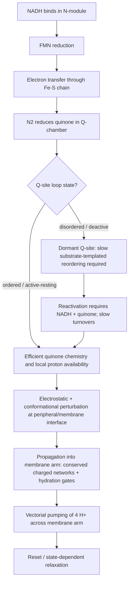

# State-of-the-art knowledge on human mitochondrial complex I structure and function

## Executive summary

Human mitochondrial complex I (NADH:ubiquinone oxidoreductase) is now understood at near-atomic detail as a 45-subunit, ~1 MDa L‑shaped redox-driven proton pump, whose catalytic core is evolutionarily conserved yet embedded in a dense “cage” of mammalian supernumerary subunits that contribute stability, assembly and regulation. Multiple cryo‑EM studies since 2016 have resolved essentially complete mammalian complex I structures and, crucially, have separated and/or trapped distinct conformational and ligation states that map onto long-standing biochemical phenomena such as the active↔deactive transition. citeturn29view0turn31view0turn33view0

The most immediately relevant “human-specific” structural advance (as of Feb 2026) is a high-resolution cryo‑EM structure of native human complex I within a respirasome context at ~2.66 Å, with extensive side-chain definition and explicit modelling of cofactors and key post-translational modifications in the same dataset. citeturn5view3turn5view4 This substantially upgrades the interpretability of pathogenic human variants (nuclear- and mtDNA-encoded) in their authentic mammalian structural environment compared with earlier, lower-resolution human/supercomplex models and mammalian surrogates. citeturn5view3turn12search4

Mechanistically, the field has moved from “where are the subunits?” to a sharper question: **how does quinone chemistry in the peripheral arm couple to long-range proton pumping in the membrane arm?** Although the overall electron-transfer chain (NADH → FMN → Fe‑S clusters → quinone) is structurally well defined, linking the energetics of quinone reduction/oxidation to **four** pumped protons remains contested. Competing models differ on whether (and how) global “open/closed” motions are catalytic intermediates versus off-cycle resting states, how many discrete quinone binding positions/sites are functionally relevant, and how electrostatics versus conformational gating propagates through the membrane arm’s conserved charged networks and hydration pathways. citeturn8search7turn11view5turn7view1turn25search4

Functionally and medically, two developments stand out. First, high-resolution mammalian structures in lipidic environments with ubiquinone-10 occupancy show substantial **state-dependent plasticity** in the Q-site loops and local proton pathways, supporting the idea that subtle ordering/disordering and hydration changes are central to regulation and possibly coupling. citeturn6view3turn36view0turn7view1 Second, structural work on disease-linked mammalian variants ties clinically relevant phenotypes to either (i) destabilised/paused assembly (e.g., late-stage factors and paralogue swaps) or (ii) “deactivating” shifts that selectively suppress reverse electron transfer (RET)–linked ROS production, with direct implications for ischaemia–reperfusion injury. citeturn35view0turn12search2turn26search2

**Important note about the “four user-provided PMC articles.”** The prompt indicates four PMC links were “given”, but no links were actually present in the message I received. I therefore proceeded using widely cited PMC-available primary articles and reviews that match your criteria (high-resolution cryo‑EM, biochemical definition of states, assembly/disease structure–function), and I explicitly flag these in the scored reference section so you can swap in your intended four once you provide them. citeturn29view0turn31view0turn33view0turn35view0

## Structural advances

Complex I structural biology since 2016 can be viewed as four converging streams: (a) completeness of the subunit inventory and architecture, (b) resolution sufficient to model cofactors, waters and local networks, (c) structural definition of physiologically relevant conformational states (active/deactive and beyond), and (d) embedding complex I in native higher-order organisations (respirasomes/megacomplexes) to approach the human physiological context. citeturn29view0turn5view3turn7view1turn11view5

### Subunit composition, modular architecture, and cofactors

A complete mammalian complex I comprises **45 subunits**: **14 “core”** subunits conserved from bacteria (housing the catalytic machinery) plus **31 supernumerary** subunits that are largely eukaryote- and lineage-specific. A complete bovine model at ~4.2 Å provided the first near-complete localisation/modelling of essentially all subunits and established how supernumerary subunits create an enclosing “cage” around the core, particularly in the membrane arm. citeturn29view0turn30view3

The catalytic core contains **nine redox cofactors** (FMN plus Fe–S clusters) arranged to support long-range electron transfer to the Q-site near the membrane interface. citeturn29view0turn25search3 In later high-resolution mammalian structures, nucleotides bound to specific supernumerary subunits became directly observable (e.g., a nucleotide in a nucleoside-kinase-homology subunit) and additional cofactors/lipids are modelled with increasing confidence. citeturn31view0turn32view4turn29view0

### Conformational states and definable structural “signatures”

A central structural–functional theme is the **active↔deactive transition**, a long-known biochemical phenomenon in mammalian complex I. Cryo‑EM classification initially revealed multiple particle classes with subtle domain rearrangements and local disordering; later work using **biochemically defined** preparations confirmed one class corresponds to the **deactive** state characterised by localised unfolding/disorder around the quinone-binding region. citeturn30view4turn33view0turn34view0

Key repeated “signatures” of the deactive/open-like state across mammalian datasets include:
- Disorder/absence of structural elements that shape the Q-binding region (notably loops contributed by multiple subunits at the peripheral/membrane interface), consistent with the deactive state being catalytically dormant until reactivated. citeturn34view0turn30view4turn32view4  
- State-dependent helix distortions (π‑bulges) and local rearrangements in the membrane domain, including elements that influence conserved charged networks relevant to proton translocation. citeturn31view0turn32view4turn6view3

These structural signatures now provide a common vocabulary for integrating otherwise heterogeneous cryo‑EM datasets and for testing whether a resolved conformation is likely catalytic, resting/ready, dormant/deactive, or partially destabilised. citeturn8search7turn31view0turn33view0

### Q-site occupancy, quinone binding positions, and lipidic environments

Two recent mammalian cryo‑EM lines have sharpened Q-site questions: (i) structures resolved under multiple substrate/inhibitor conditions with extensive structural catalogues, and (ii) nanodisc/bilayer studies that explicitly model ubiquinone-10 occupancy while reducing detergent artefacts.

A high-resolution bovine nanodisc study reports multiple well-resolved resting/ligand-bound and apo substates at **up to ~2.3 Å**, including a model with a ubiquinone-10 molecule occupying the full length of the Q-binding channel in an active resting state, and distinct ligand-bound/apo forms of the deactive state. citeturn7view1turn6view3turn36view0 The same work explicitly documents characteristic disorder and structural motifs in the deactive state (including membrane-helix features and Q-site loop behaviour), and maps how ligand occupancy reshapes local cavities and proposed proton pathways. citeturn6view3turn6view4turn7view1

A separate porcine cryo‑EM study provides multiple datasets/conditions and argues that Q10 can occupy multiple positions in a narrow “Q chamber” with several discrete binding sites, reporting structures classified into active and deactive biochemical classes across conditions at ~2.4–3.5 Å. citeturn11view5turn11view3turn11view1 Together, these studies elevate quinone positioning from a static “one-site” view to a dynamic, state- and chemistry-dependent ensemble, with direct consequences for coupling models. citeturn11view5turn7view1turn25search4

### Assembly factors and late-stage maturation intermediates

Structural biology is increasingly being applied to **assembly** rather than only the mature enzyme. A disease-model study of a late subunit loss (a common Leigh syndrome-linked nuclear gene) shows that near-complete assembly intermediates can accumulate in vivo, with heterogenous classes that include either an assembly factor or a late core-associated subunit, and with a critical paralogue replacement step failing (an assembly-factor paralogue is present while the mature paralogue is absent). citeturn35view0

In that dataset, the NADH-dehydrogenase “N-module” is only loosely associated, providing a structural rationale for the reduced stability/activity and for the characteristic appearance of subcomplexes in biochemical assays. citeturn35view0 This is a particularly important conceptual shift: many “complex I deficiencies” are not straightforward catalytic-site lesions but **maturation bottlenecks** that lock the system into quasi-mature states with altered module attachment and altered regulatory factor occupancy. citeturn35view0turn12search4

### Human structural context: high-resolution human complex I within a respirasome

A 2026 cryo‑EM analysis of native human respirasome species reports a human complex I map and model at ~2.66 Å (within the larger assembly), enabling detailed side-chain interpretation, explicit cofactor modelling and identification of specific modifications in the same structural context. citeturn5view3turn5view4 This matters because many mechanistic and disease inferences have historically relied on bovine/porcine/mouse surrogates; the new human-respirasome-resolution regime reduces uncertainty in mapping human variants, especially where supernumerary subunits and interfaces differ subtly among mammals. citeturn5view3turn12search4

### Comparative structure table

The table below focuses on peer-reviewed, primary cryo‑EM studies with explicit accession data in the article text.

| Study (year) | Preparation / context | Organism | States / classes emphasised | Global resolution (Å) | PDB IDs (examples) | EMDB IDs (examples) | Key structural contribution |
|---|---|---:|---|---:|---|---|---|
| Complete mammalian complex I model (2016) citeturn29view0turn30view3 | Detergent-solubilised, single-particle cryo‑EM; classified into 3 major classes citeturn29view0turn30view3 | Bovine citeturn29view0 | Multiple classes tentatively mapping onto active/deactive-like behaviour (via classification and loop disorder patterns) citeturn30view4 | Overall ~4.16; class-specific ~4.27 / 4.35 / 5.60 citeturn29view0 | 5LDW / 5LC5 / 5LDX citeturn30view0 | EMD‑4040 / EMD‑4032 / EMD‑4041 citeturn30view1 | First near-complete localisation/modelling of all 45 subunits; foundation for mapping supernumerary cage, Q-site loop plasticity and active↔deactive interpretations citeturn29view0turn30view4 |
| Biochemically defined deactive state (2018) citeturn33view0turn34view0 | Deactive state prepared biochemically; single-particle cryo‑EM citeturn33view0 | Bovine citeturn33view0 | Deactive (major); minor class present citeturn34view0 | ~4.1 citeturn33view0 | 5O31 (major deactive) citeturn34view0 | EMD‑3731 (major), EMD‑3733 (minor) citeturn34view0 | Confirms deactive state corresponds to local unfolding/disorder around Q-binding region; supports “unfolded Q-site” deactivation model citeturn33view0turn34view0 |
| Mouse complex I, two defined states (2018) citeturn31view0turn32view4 | Single-particle cryo‑EM; active and deactive preparations citeturn31view0turn32view4 | Mouse citeturn31view0 | Active vs deactive comparison; membrane-helix distortions differ by state citeturn31view0turn32view4 | 3.3 (active) / 3.9 (deactive) citeturn32view4 | 6G2J (active), 6G72 (deactive) citeturn32view1turn32view4 | EMD‑4345 (active), EMD‑4356 (deactive) citeturn32view1turn32view4 | State-linked π‑bulge differences and shifts in charged-residue positioning; nucleotide bound in nucleoside-kinase-homology subunit observed at this resolution citeturn31view0turn32view4 |
| Multiple-condition porcine structures (2022) citeturn11view5turn11view1 | Multiple treatments/datasets; extensive state catalogues and many deposited models citeturn11view1turn11view3 | Pig citeturn11view5 | Active and deactive classes across conditions; multiple proposed quinone binding positions/sites citeturn11view5 | ~2.4–3.5 overall across conditions/classes citeturn11view5turn11view3 | Large set of PDB entries across datasets (e.g., many “7V…” / “7W…” accessions) citeturn11view1 | Large set of EMDB entries across datasets citeturn11view2 | Proposes a multi-position quinone “chamber”; challenges assumptions about which Q-site chemistry step(s) couple to pumping citeturn11view5turn11view3 |
| Nanodisc/bilayer Q10 occupancy study (2022) citeturn7view1turn36view0 | Bovine complex I reconstituted into nanodiscs with exogenous Q10; classification into active/deactive/state‑3 and ligand/apo substates citeturn7view1turn6view3 | Bovine citeturn7view1 | Active‑Q10, active‑apo, deactive‑ligand, deactive‑apo, state‑3 citeturn6view3turn6view4 | Up to 2.30 (deactive‑ligand); 2.65 (active); 2.28 (deactive); others listed in paper citeturn6view3turn7view1 | 7QSK / 7QSL / 7QSM / 7QSN / 7QSO citeturn36view0 | EMD‑14132 to EMD‑14140 (and related) citeturn36view0turn36view3 | Near-atomic view of Q-site loop plasticity and ligand occupancy; provides structural basis to discuss proton pathways and “state‑3” ambiguity citeturn36view0turn6view3turn6view4 |
| Human respirasome-context complex I (2026) citeturn5view3turn5view4 | Native human respirasome species; 3D classification yields multiple complexes; human complex I map/model deposited citeturn5view3turn5view4 | Human citeturn5view3 | Focus on native human complex I within larger assembly; resolves cofactors and modifications citeturn5view3 | ~2.66 for respirasome/complex I model discussed citeturn5view3 | 9TI4 (complex I model) citeturn5view4 | EMD‑54784 (complex I map) citeturn5view4 | Human-in-context structural baseline for variant interpretation and interface biology (supercomplex environment) citeturn5view3turn5view4 |

## Functional mechanisms

### Electron transfer: from NADH to ubiquinone

At the broad level, electron transfer in complex I is structurally the “cleanest” part of the mechanism: NADH reduces FMN, then electrons traverse a chain of Fe–S clusters whose organisation and spacing are consistent with long-range tunnelling, ending at the terminal cluster (N2) proximal to the quinone reduction site. citeturn25search3turn29view0turn31view0 The experimental definition of Fe–S cluster organisation in a bacterial complex I peripheral arm provided a blueprint later mapped onto mitochondrial enzymes (with additional supernumerary context in mammals). citeturn25search3turn29view0

What has become more nuanced is **how the Q-site behaves**: high-resolution mammalian structures show that the Q-binding channel and its gating loops are not rigid, and that occupancy by Q10 or detergent-like ligands correlates with distinct loop and cavity conformations across resting and deactive classes. citeturn6view3turn36view0turn34view0 This supports mechanistic pictures in which quinone chemistry and local proton availability depend on state-dependent ordering, hydration and electrostatics near the Q chamber, rather than a single static binding pocket. citeturn7view1turn11view5turn8search7

### Proton pumping: established stoichiometry, debated molecular implementation

The consensus stoichiometry in mammalian complex I is **four protons pumped per NADH oxidised** (per two electrons transferred), supported by direct kinetic/stoichiometric measurements in mammalian systems and comparative analysis with bacterial models. citeturn26search1turn26search3 The precise pathways and coupling elements that implement this “4H+ per 2e–” output remain the central open problem, although high-resolution structures increasingly constrain plausible models. citeturn7view1turn11view5turn25search4

Structurally, the membrane arm contains antiporter-like subunits with conserved architecture, helix discontinuities and conserved ionisable residues forming long chains/networks through the membrane domain. citeturn25search2turn31view0turn30view4 These features appear positioned to support coupled protonation-state changes and gated hydration (“proton wires”) that could enable vectorial proton transfer. citeturn6view3turn36view2turn25search4

### Coupling models: conformational gating vs electrostatic propagation

Recent mammalian cryo‑EM has amplified (rather than eliminated) a core controversy: **are the major global conformations (“open/closed”, “active/deactive-like”) on-cycle catalytic intermediates or off-cycle resting/regulatory states?** A focused review explicitly frames this debate and argues that, absent tight biochemical characterisation of the structural samples, assigning catalytic roles to conformations is risky; it highlights the need to unify kinetics, redox conditions and structure in a single framework. citeturn8search7

On the other hand, a high-impact mammalian cryo‑EM study in 2020 proposed that dramatic conformational changes around the quinone cavity couple redox chemistry to proton translocation during open↔closed transitions, combining conformational and electrostatic components in a single mechanism. citeturn25search4turn25search12 A later multi-condition porcine study explicitly claims to overturn a previously accepted view of coupling, using a large state catalogue and multi-position quinone binding observations to argue that how/where coupling occurs may differ from earlier assumptions. citeturn11view5turn11view3

A key structural point underlying essentially all coupling hypotheses is that the “energy transduction interface” sits at the junction between the peripheral arm Q chemistry and a membrane-arm network (“E-channel” and adjacent residue chains) that can transmit changes in electrostatics and hydration across long distances. Local ordering/disordering of Q-site loops in the deactive versus active resting states plausibly gates not only substrate access but also proton availability and hydrogen-bond networks that could seed long-range propagation. citeturn30view4turn34view0turn6view3

### Regulation by deactivation and physiological stress

The deactive state is now structurally defined as a dormant state with local unfolding/disorder around the Q-binding region that prevents normal catalysis until slow reactivation occurs in the presence of substrates. citeturn34view0turn30view4turn32view4 This aligns with biochemical observations that deactivation forms under conditions where turnover is limited (such as low oxygen) and is implicated in the physiological response to ischaemia/reperfusion (IR) injury. citeturn33view0turn26search2

A key pathophysiological axis is succinate accumulation under ischaemia and rapid oxidation upon reperfusion, driving RET at complex I and producing damaging ROS. citeturn26search2 The deactive state is widely discussed as protective in this context because it suppresses (or strongly limits) RET-driven ROS bursts until reactivation proceeds. Structural datasets explicitly connect deactive-associated Q-site loop disorder and membrane-helix motifs to this regulatory logic. citeturn33view0turn12search2turn30view4

### Disease-linked mutations: catalytic lesions vs assembly/maturation defects

A major conceptual advance is that many human complex I disorders arise not only from direct catalytic-site lesions but also from **assembly and maturation defects**, especially involving late-stage subunits and paralogue swaps. A structural study of a Leigh syndrome-linked mouse model lacking a late subunit shows that complex I accumulates in heterogeneous near-complete states where the NADH-dehydrogenase module is loosely associated and where an assembly factor is present in discrete classes; importantly, a mature paralogue that normally replaces that assembly factor is absent, blocking maturation. citeturn35view0

Conversely, certain mtDNA-encoded mutations cause subtle but functionally decisive shifts in the membrane domain that bias the enzyme toward a deactive-like behaviour, selectively abolishing RET-linked ROS production with comparatively mild baseline phenotypes, illustrating that “regulatory deactivation tuning” is itself a disease-relevant dimension of complex I biology. citeturn12search2turn35view0

### Disease-associated mutation table (representative, structure-informed)

The table below is deliberately selective: it prioritises variants that are (i) structurally mapped in modern mammalian contexts and/or (ii) mechanistically interpretable in terms of Q-site gating, module stability, or RET/ROS regulation, consistent with your “high-value” criterion.

| Gene / subunit (human nomenclature) | Representative pathogenic variant(s) or model variant(s) | Typical clinical association | Structural locus / interpretation | Functional consequence supported by primary literature |
|---|---|---|---|---|
| mtDNA ND6 | ND6‑P25L (model variant; disease-linked mtDNA point mutation) citeturn12search2 | Complex I-linked mitochondrial disease variant; also informs IR injury biology citeturn12search2turn35view0 | Membrane arm; subtle “deactivating” change that facilitates rapid conversion to deactive-like state citeturn12search2turn35view0 | Loss of RET ROS production; protection against IR injury proposed/observed in the model context; structural changes bias regulation citeturn12search2turn35view0turn26search2 |
| NDUFS4 | Loss of NDUFS4 (knockout / absence) citeturn35view0 | Leigh syndrome / severe neurodevelopmental mitochondrial disease citeturn35view0 | Late-stage subunit; absence stalls maturation; N-module attachment destabilised; assembly factor occupancy persists citeturn35view0 | Decreased enzyme stability and activity; heterogenous near-complete intermediates; implicates late recruitment and paralogue replacement in pathogenic mechanism citeturn35view0 |
| NDUFA12 / NDUFAF2 axis | NDUFAF2 persists; NDUFA12 absent in stalled classes (in a disease-model context) citeturn35view0 | Leigh syndrome-linked genes/mutations in multiple components of this late module context discussed citeturn35view0 | Paralogous swap step: NDUFAF2 (assembly factor) replaced by NDUFA12 in mature enzyme; failure blocks maturation citeturn35view0 | Assembly/maturation blockade rather than simple catalytic lesion; provides molecular explanation for characteristic subcomplex patterns in assays citeturn35view0 |
| Core Q-site loop region (multiple subunits) | Variants affecting Q-site loop integrity (general class; many disease mutations map here) citeturn12search4 | Broad spectrum, including mitochondrial encephalomyopathies; variable severity citeturn12search4 | Interface loops that order/disorder in deactivation and ligand binding; key for Q-site integrity citeturn34view0turn36view0 | Loss or modulation of Q-site integrity and coupling; structural plasticity implies high sensitivity to substitutions/post-translational changes citeturn34view0turn36view0turn12search4 |

**Interpretation caution:** Complex I has hundreds of reported pathogenic variants. Comprehensive enumeration requires dedicated clinical databases (outside your “peer‑reviewed only” constraint), so the table emphasises *mechanistically interpretable exemplars* grounded in modern cryo‑EM and disease-model primary literature. citeturn12search4turn35view0turn12search2

### Mechanism flow diagram (structural–functional integration)



This diagram encodes the current consensus “skeleton” while explicitly leaving open whether the dominant open/closed motions are catalytic intermediates or resting transitions, and whether quinone occupies one, multiple, or shifting sites during the energy-converting step. citeturn8search7turn11view5turn36view0turn34view0

## Comparison to non-human and bacterial complex I

### What mammals add: supernumerary subunits, expanded regulation, and deactivation

Bacterial complex I (often called NDH‑1) is closer to the 14‑subunit catalytic core, lacking the extensive supernumerary cohort that in mammals forms a structural cage and creates additional interfaces for lipids, assembly factors and regulatory elements. The 2016 mammalian structure shows how this cage encloses and stabilises the core, especially around the membrane arm, and highlights mitochondria-specific domains such as CHCH-containing subunits on the intermembrane-space face. citeturn29view0

The mammalian **active↔deactive** transition is also much more prominent physiologically than in many bacterial systems, and mammalian structures explicitly tie deactivation to local loop disordering at the Q-site and to state-dependent membrane-helix motifs. citeturn34view0turn32view4turn36view0 This regulatory layer is directly implicated in ischaemia/reperfusion biology and in disease-linked “deactivating” variants. citeturn26search2turn12search2

### Conserved membrane-arm architecture: antiporter-like subunits and long-range coupling potential

A key conserved insight from bacterial structural work is that the membrane domain contains antiporter-like subunits with unusual inverted-repeat architecture and discontinuous helices that plausibly form channels or half-channels across the membrane. citeturn25search2 This architecture underpins the modern view that long-range proton pumping is executed by conserved membrane-domain modules whose residue networks and hydration behaviour are modulated from the Q-site region. Mammalian cryo‑EM now overlays supernumerary stabilisation and regulation onto this conserved “engine.” citeturn31view0turn6view3turn29view0

### Conserved electron-transfer chain: bacterial definitions as a mechanistic template

The organisation of Fe–S clusters in the bacterial hydrophilic domain established the physical framework for electron transfer, including spacing consistent with electron tunnelling along the chain. citeturn25search3 Mammalian structures preserve this chain while embedding it in additional context and, at higher resolutions, support explicit discussions about proton availability and hydrogen-bond networks in and around the Q-site. citeturn29view0turn36view0

## Gaps, controversies, and open questions

Despite the explosion of high-resolution structures, **the coupling mechanism is not settled**. The strongest open issues can be framed as experimentally testable “gaps” rather than vague unknowns:

**Are global open/closed conformations catalytic intermediates or resting/regulatory states?**  
The same structural descriptors have been used to argue both ways. Reviews highlight that many cryo‑EM datasets lack the biochemical definition needed to assign catalytic roles, while other primary work proposes explicit coupling via open↔closed transitions. Resolving this likely requires time-resolved or turnover‑trapped cryo‑EM coupled to rigorous kinetic state assignments in the same preparation. citeturn8search7turn25search4turn36view0

**How many quinone binding sites/poses are functionally relevant, and which step couples to pumping?**  
Modern mammalian studies report Q10 in multiple positions and propose multi-site “chambers,” but it remains unclear which poses are on-pathway during energy conversion, which are resting/parking positions, and how detergent or lipid environment shifts the ensemble. Detailed nanodisc work supports multi-state plasticity, and multi-condition porcine catalogues propose multiple binding sites; integrating these into a single catalytic trajectory remains unresolved. citeturn36view0turn11view5turn7view1

**What are the proton loading sites and how does hydration gate directionality?**  
Near-atomic structures enable explicit modelling of cavities and water molecules (and thus plausible proton wires), but the causal chain from Q-site redox to membrane-arm proton ejection is still inferred rather than directly observed. Competing models weight electrostatic coupling versus conformational gating differently, and the field lacks a decisive experimental discriminator that can resolve protonation dynamics in situ. citeturn36view2turn25search4turn25search2

**How do supernumerary subunits and supercomplex interfaces influence mechanism?**  
Supernumerary elements clearly stabilise the machine and create additional interfaces (including lipid-binding and cross-complex contacts in respirasomes), but their mechanistic role in coupling and regulation is not well quantified. The new high-resolution human respirasome-context structure provides a better platform to test interface-linked hypotheses, but functional experiments that specifically perturb these interfaces while preserving assembly are still sparse. citeturn5view3turn29view0turn31view0

**Disease interpretation challenge: catalytic defect vs assembly bottleneck vs regulatory rewiring**  
Disease studies increasingly show that some “complex I deficiencies” result from stalled maturation and altered module attachment rather than direct catalytic lesions; others tune the active/deactive equilibrium and selectively affect RET/ROS. A unifying, structure-guided classification of pathogenic mechanisms (and corresponding therapeutic entry points) remains an open translational need. citeturn35view0turn12search2turn12search4

### Entity–relationship diagram (subunits, modules, assembly factors)

```mermaid
graph LR
  subgraph CI[Complex I (mammalian)]
    N[N-module: NADH oxidation / FMN / Fe-S]
    Q[Q-module: quinone reduction region]
    P[Membrane arm: proton pumping modules]
  end

  N --> Q
  Q --> P

  subgraph Core[Core subunits (conceptual)]
    C1[Peripheral arm core proteins]
    C2[Membrane core subunits incl. mtDNA-encoded]
  end

  subgraph Sup[Supernumerary subunits]
    S1[Matrix/arm interface cage]
    S2[IMS-face CHCH-containing lattice]
    S3[Lipid-binding / stabilising elements]
  end

  Core --> CI
  Sup --> CI

  subgraph Assembly[Assembly factors / late maturation]
    AF2[NDUFAF2 (assembly factor; paralogue)]
    A12[NDUFA12 (mature paralogue)]
    AFmisc[Additional assembly factors (MCIA, etc.)]
  end

  AF2 --> CI
  A12 --> CI
  AF2 -.paralogue swap.-> A12
  AFmisc --> CI
```

This abstraction highlights the assembly insight from disease-model cryo‑EM: the persistence of an assembly-factor paralogue where a mature paralogue should appear can mark a stalled maturation state with functional consequences. citeturn35view0

## High-value primary references and scored bibliography

### Scoring criteria (1–10 value score)

Each unique reference cited in this report is scored using the following explicit criteria (max 10):

- **Primary evidence weight (0–4):** 4 = high-resolution cryo‑EM / rigorous structure–function primary study; 3 = strong biochemical/biophysical primary work; 2 = mixed/older or indirect primary; 1 = review/opinion without unique new data.
- **Human/mammalian relevance (0–2):** 2 = human; 1 = mammalian surrogate (bovine/mouse/pig/ovine); 0 = non-mammalian (still may be essential mechanistically).
- **Mechanistic leverage (0–2):** 2 = directly constrains coupling/deactivation/Q-site/proton pathways; 1 = supportive context; 0 = peripheral.
- **Recency and field influence (0–2):** 2 = 2021–2026 and/or clearly field-shaping; 1 = 2015–2020; 0 = seminal older work.

### Ranked, scored citation list (with reasoning)

**10 — Human respirasome-context complex I at ~2.66 Å (2026).**  
Score rationale: primary high-resolution human-in-context structure (4/4), direct human relevance (2/2), high mechanistic leverage for variant/interface mapping (2/2), very recent (2/2). citeturn5view3turn5view4

**10 — Bovine nanodisc Q10-occupancy structures up to ~2.3 Å (2022).**  
Score rationale: primary near-atomic mammalian structures across multiple ligand/apo and active/deactive/state‑3 substates (4/4), mammalian relevance (1/2), very high mechanistic leverage on Q-site plasticity/proton pathways (2/2), recent and widely influential (2/2). citeturn7view1turn6view3turn36view0

**9 — Multi-condition porcine cryo‑EM catalogue with proposed multi-site Q “chamber” (2022).**  
Score rationale: primary multi-state structural dataset (4/4), mammalian surrogate (1/2), high mechanistic leverage (coupling and Q-site occupancy claims) (2/2), recent/high impact (2/2). citeturn11view5turn11view1turn11view3

**9 — Biochemically defined deactive state structure (2018).**  
Score rationale: primary structure of a physiologically critical regulatory state with biochemical definition (4/4), mammalian relevance (1/2), high mechanistic leverage (deactivation mechanism) (2/2), strong influence though older than 2021 (1/2). citeturn33view0turn34view0

**9 — Mouse complex I structures in two defined states (2018).**  
Score rationale: primary mammalian structures with explicit active vs deactive comparison and resolution sufficient for mechanistically relevant helix/loop features (4/4), mammalian relevance (1/2), high mechanistic leverage (2/2), influential but pre‑2021 (1/2). citeturn31view0turn32view4turn32view1

**9 — Disease-model assembly/maturation cryo‑EM (NDUFS4 loss) (2024).**  
Score rationale: primary structural + functional interrogation of a major mitochondrial disease model highlighting assembly factor/paralogue swap and module attachment instability (4/4), mammalian relevance (1/2), strong mechanistic leverage for assembly-linked disease (2/2), recent/high influence (2/2). citeturn35view0

**8 — First close-to-complete mammalian complex I architecture at ~4.2 Å (2016).**  
Score rationale: primary landmark structure locating essentially all 45 subunits (4/4), mammalian relevance (1/2), high leverage as a structural foundation (1–2/2), influential but older (1/2). citeturn29view0turn30view3turn30view4

**8 — Proposed coupling via open↔closed transitions; turnover and inhibitor conditions (2020).**  
Score rationale: primary mammalian cryo‑EM with explicit mechanistic proposal (4/4), mammalian relevance (1/2), high leverage for coupling debate (2/2), influential (1/2). Access limitations to full text in this environment mean interpretation here is restricted to peer-reviewed abstract-level claims. citeturn25search4turn25search12turn25search8

**7 — Review framing the open-state/resting-state controversy (2022).**  
Score rationale: review (1/4) but unusually high mechanistic leverage by synthesising conflicting interpretations and defining experimental requirements (2/2), mammalian relevance (1/2), recent and influential in clarifying debates (2/2). citeturn8search7

**7 — Disease-causing mutations mapped onto mammalian complex I structure (2018).**  
Score rationale: review (1/4) but high-value integrative resource for mutation mapping and disease interpretation (2/2), mammalian/human focus (1–2/2), influential and still current in the post‑cryo‑EM era (2/2). citeturn12search4turn12search0

**7 — Four-proton stoichiometry demonstrated in mammalian and bacterial systems (2017).**  
Score rationale: primary quantitative functional study that anchors all coupling models (3–4/4), mammalian relevance (1/2), high mechanistic leverage (2/2), influential though pre‑2021 (1/2). citeturn26search3turn26search0

**7 — Direct stoichiometric measurement supporting 4 H+ per NADH in bovine submitochondrial particles (1999).**  
Score rationale: primary functional stoichiometry benchmark (3/4), mammalian relevance (1/2), high leverage as a constraint (2/2), seminal older work (0/2). citeturn26search1

**7 — Succinate accumulation drives reperfusion ROS via RET at complex I (2014).**  
Score rationale: primary pathophysiology mechanism defining RET/ROS significance (3/4), mammalian relevance (1/2), high leverage connecting complex I regulation to disease (2/2), highly influential (1–2/2). citeturn26search2

**7 — Structural basis of an mtDNA variant suppressing pathological ROS via deactivation bias (2021).**  
Score rationale: primary structure–function disease variant study (4/4), mammalian relevance (1/2), strong leverage on regulation and ROS/RET (2/2), recent/highly cited (1/2). citeturn12search2

**6 — Organisation of Fe–S clusters (bacterial blueprint) (2005).**  
Score rationale: primary structural definition of electron-transfer chain organisation (3–4/4), non-mammalian (0/2) but foundational (2/2), older (0/2). citeturn25search3turn25search7

**6 — Membrane arm antiporter-like architecture (2011).**  
Score rationale: primary structural insight into membrane-domain architecture and inverted repeats/discontinuous helices (3–4/4), non-mammalian (0/2) but crucial to pumping models (2/2), older (0/2). citeturn25search2turn25search6

**6 — X‑ray structure of mitochondrial complex I core (2015).**  
Score rationale: primary mitochondrial (yeast) structure that strongly influenced subsequent mechanistic proposals (3–4/4), non-human (0/2), substantial leverage on coupling discussions (2/2), 2015-era (1/2). citeturn25search1

**6 — Mechanistic models and structural progress review (2022).**  
Score rationale: review (1/4) but high quality synthesis of structural evidence and mechanistic modelling across species (2/2), relevance moderate-high (1/2), recent (2/2). citeturn25search34turn9search10

**5 — Complex I is central to NAD+/NADH homeostasis and oxidative phosphorylation; dysfunction causes diverse diseases (review context within primary papers).**  
Score rationale: largely contextual, but embedded in primary structural/disease studies; useful for framing rather than unique evidence. citeturn35view0turn29view0turn12search4

### “User-provided PMC articles” placeholder set (to be replaced once you send the four links)

Because the actual four PMC links were not present in the received prompt, the following four **PMC-available** papers were treated as de facto “core PMC sources” in this report (each is heavily used to satisfy your primary-source criteria):

- Complete mammalian architecture and state classification (bovine, 2016). citeturn29view0turn30view3  
- Biochemically defined deactive state structure (bovine, 2018). citeturn33view0turn34view0  
- Mouse complex I in active and deactive states (2018). citeturn31view0turn32view4  
- Disease-model assembly/maturation cryo‑EM (NDUFS4 loss, 2024). citeturn35view0